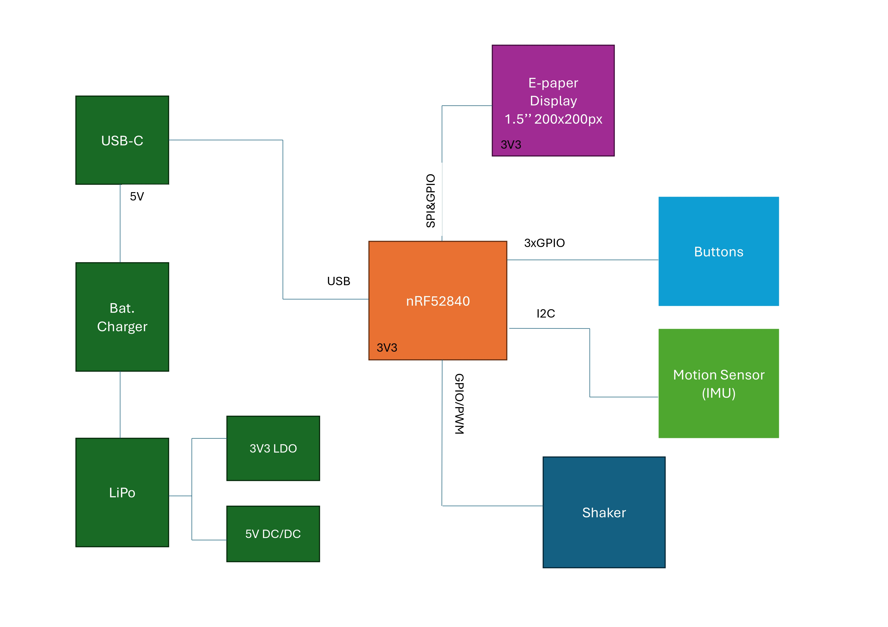
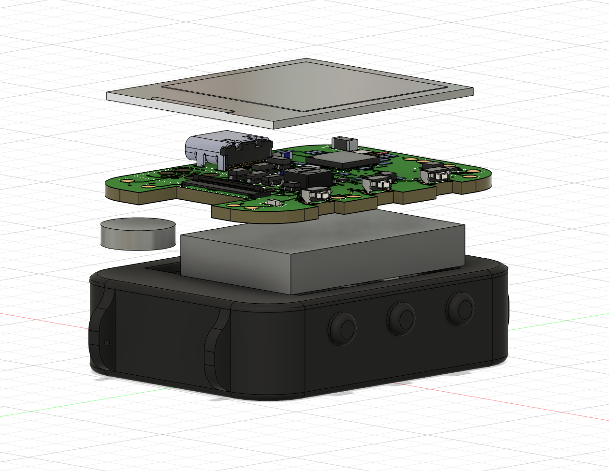

# InkTime Watch

## Overview
InkTime Watch is a low-power smartwatch based on the nRF52840 microcontroller, designed for efficient timekeeping, motion tracking, and e-paper display usage.

## Hardware diagram & features

This is an open-hardware wearable based on the nRF52840 microcontroller. It is fully compatible with embedded C/C++ development and comes with the following features:

* [nRF52840](https://files.seeedstudio.com/wiki/XIAO-BLE/Nano_BLE_MCU-nRF52840_PS_v1.1.pdf) microcontroller (ARM Cortex-M4F @ 64 MHz, Bluetooth 5 / BLE, 2.4 GHz radio, 1 MB Flash and 256 KB RAM, multiple interfaces: SPI, I2C, UART, GPIO, support for external antenna)
* [E-paper Display](https://www.waveshare.com/1.54inch-e-paper-module.htm?srsltid=AfmBOooLaZDBFF5ey5FPMcwvfQjNszGLTJooliuUE0Pt89mi3RbbW3zz) 1.54 inch, 200x200 resolution, communicating via SPI interface
* [BMA423](https://watchy.sqfmi.com/assets/files/BST-BMA423-DS000-1509600-950150f51058597a6234dd3eaafbb1f0.pdf) accelerometer (3-axis ultra-low-power MEMS accelerometer, integrated step counting and activity recognition, motion detection interrupts, FIFO buffer, I2C/SPI interface, optimized for wearable low-power applications)
* [BQ25180](https://www.ti.com/product/BQ25180) LiPo Charger (I2C-controlled single-cell Li-Ion/Li-Po charger, 5V USB input, up to ~250 mA charging current, integrated power path management, ultra-low power for wearables)
* [250 mAh LiPo battery](https://elektronik.ropla.eu/pdf/stock/aky/aky1119.pdf)
* [FIT0774](https://www.tme.eu/ro/details/df-fit0774/motoare-dc/dfrobot/fit0774/) vibration motor (small DC vibration motor, 10 mm diameter, 2.7 mm height, 1.5–4.2 V operating voltage, used for haptic feedback in wearable devices)
* [TC2030-IDC](https://www.digikey.ro/ro/products/detail/tag-connect-llc/TC2030-IDC/4571121) debug connector (Tag-Connect 10-pin SWD programming interface, no-socket pogo-pin connector, supports SWDIO, SWDCLK, RESET, VCC and GND, used for low-profile in-circuit debugging of MCUs)
* [DRV2605L](https://www.ti.com/product/DRV2605L) haptic driver (I2C-controlled vibration motor driver with integrated haptic library, supports ERM and LRA actuators, automatic resonance tuning, low-power operation for wearable haptic feedback systems)
* [DS6160A](https://www.mouser.com/datasheet/2/1458/DS6160A_02-3104604.pdf?srsltid=AfmBOorjUBAXZpq5Z5uEI1jLcgjTr8TjWB5ry58Sj_L0fmmZSXPHWXP2) regulator (dual-channel low-power audio power amplifier / driver IC, designed for small speaker or actuator applications, wide supply voltage range, high efficiency Class-D operation, suitable for compact battery-powered systems)
* [MAX17048](https://www.analog.com/en/products/max17048.html) fuel gauge (ultra-low-power single-cell Li-ion battery fuel gauge IC, I2C interface, uses ModelGauge algorithm for accurate state-of-charge estimation, no external sense resistor required, optimized for wearable and portable devices)

## Bill of Materials (BOM)

The table below summarizes the main components used in the project. Passive components are grouped by type and package to improve readability.

| Component | Description | Qty | Manufacturer | Part Number | Datasheet | 
|----------|------------|-----|--------------|-------------|-----------|----------------|
| nRF52840 | BLE Microcontroller | 1 | Nordic Semiconductor | nRF52840 | [Datasheet](https://files.seeedstudio.com/wiki/XIAO-BLE/Nano_BLE_MCU-nRF52840_PS_v1.1.pdf) | 
| BMA423 | 3-axis accelerometer (IMU) | 1 | Bosch | BMA423 | [Datasheet](https://watchy.sqfmi.com/assets/files/BST-BMA423-DS000-1509600-950150f51058597a6234dd3eaafbb1f0.pdf) |
| BQ25180 | Battery charger / PMIC | 1 | Texas Instruments | BQ25180 | [Datasheet](https://www.ti.com/product/BQ25180) |
| DRV2605L | Haptic driver | 1 | Texas Instruments | DRV2605L | [Datasheet](https://www.ti.com/product/DRV2605L) |
| MAX17048 | Fuel gauge | 1 | Analog Devices | MAX17048G+T10 | [Datasheet](https://www.analog.com/en/products/max17048.html) | 
| RT6160 | Buck-boost converter | 1 | Richtek | RT6160AWSC | [Datasheet](https://www.mouser.com/datasheet/2/1458/DS6160A_02-3104604.pdf) | 
| 2450AT18B100E | 2.4GHz chip antenna | 1 | Johanson Technology | 2450AT18B100E | [Datasheet](https://jlcpcb.com/api/file/downloadByFileSystemAccessId/8588940948130156544) |
| TC2030-IDC | Programming connector | 1 | Tag-Connect | TC2030-IDC | [Datasheet](https://www.lcsc.com/datasheet/C5444772.pdf) | 
| USB-C Connector | Power & data interface | 1 | Kinghelm | KH-TYPE-C-16P | [Datasheet](https://jlcpcb.com/api/file/downloadByFileSystemAccessId/8588905154556923904) | 
| FPC Connector | E-paper display connector | 1 | Molex | 503480-2400 | [Datasheet](https://www.molex.com/content/dam/molex/molex-dot-com/products/automated/en-us/salesdrawingpdf/503/503480/5034802400_sd.pdf?inline\) | 
| Push Buttons | Tactile switches | 3 | Panasonic | EVP-AKE31A | [Datasheet](https://wmsc.lcsc.com/wmsc/upload/file/pdf/v2/lcsc/2301111010_PANASONIC-EVPAKE31A_C569760.pdf) | 
| Inductors | Power inductors (various values) | Multiple | TDK / Würth | Various | [Datasheet]() | 
| MOSFETs | Power switching | 2 | Vishay / Diodes Inc. | SI1308EDL / DMG2305UX | [Datasheet](https://www.lcsc.com/datasheet/C469327.pdf) | 
| Diodes | Schottky diodes | 3 | ON Semiconductor | MBR0530 | [Datasheet](https://www.lcsc.com/datasheet/C77336.pdf) | 
| ESD Protection | USB protection | 1 | STMicroelectronics | USBLC6-2SC6 | [Datasheet](https://www.lcsc.com/datasheet/C7519.pdf) | 
| Crystal | 32MHz | 1 | - | - | [Datasheet](https://wmsc.lcsc.com/wmsc/upload/file/pdf/v2/lcsc/2312080231_NDK-NX2016SA-32MHZ-EXS00A-CS11336_C6134317.pdf) | 
| Crystals | 32.768kHz | 1 | - | - | [Datasheet](https://jlcpcb.com/partdetail/SeikoEpson-FC_135_32_7680KAA3/C2650472) | 
| Capacitors | 0201 / 0402 (100nF, 1uF, etc.) | Multiple | Murata | Various | Datasheet | 
| Resistors | 0201 resistors | Multiple | Panasonic | Various | Datasheet | 
| Test Pads | Debug & measurement points | 14 | - | - | - | 

## nRF52840 Pin Mapping

| Pin nRF52840 | Signal      | Component | Interface |
|-------------|------------|------------|----------|
| P0.00/XL1   | XL1        | Crystal X2 (32.768kHz) | XTAL |
| P0.01/XL2   | XL2        | Crystal X2 (32.768kHz) | XTAL |
| P0.05/AIN3  | EPD_CS     | E-Paper (J1 FPC) | SPI CS |
| P0.06       | SDA        | BMA423, BQ25180, MAX17048, DRV2605 | I2C SDA |
| P0.07       | SCL        | BMA423, BQ25180, MAX17048, DRV2605 | I2C SCL |
| P0.08       | IMU_INT1   | BMA423 | GPIO Input |
| P1.08       | IMU_INT2   | BMA423 | GPIO Input |
| P0.11       | PMIC_INT   | BQ25180 | GPIO Input |
| P0.12       | HAPTIC_EN  | DRV2605 | GPIO |
| VBUS        | VBUS       | USB-C (J4) | Power |
| D-          | D-         | USB-C (J4) / USBLC6 | USB |
| D+          | D+         | USB-C (J4) / USBLC6 | USB |
| P0.13       | SW_UP      | Buton Up | GPIO Input |
| P0.14       | SW_ENT     | Buton Enter | GPIO Input |
| P0.15       | EPD_DC     | E-Paper (J1 FPC) | SPI DC |
| P0.16       | EPD_RST    | E-Paper (J1 FPC) | GPIO |
| P0.17       | EPD_BUSY   | E-Paper (J1 FPC) | GPIO Input |
| P0.18/RESET | RESET      | TC2030-IDC | SWD/GPIO |
| SWDCLK      | SWDCLK     | TC2030-IDC | SWD |
| SWDIO       | SWDIO      | TC2030-IDC | SWD |
| P1.02       | SW_DN      | Buton Down | GPIO Input |
| P0.10/NFC2  | ALERT      | MAX17048 | GPIO Input |
| ANT         | RF         | Antena 2450AT18B100E | RF |
| P0.02/AIN0  | SCK        | E-Paper (J1 FPC) | SPI SCK |
| P0.03/AIN1  | MOSI       | E-Paper (J1 FPC) | SPI MOSI |

## Design Log

## Repository contens
- schematic.sch → Schematic design file  
- board.brd → PCB layout file  

### Manufacturing
- GerberFiles.zip → PCB manufacturing files (Gerber + drill files)  
- bom.csv / bom.xlsx → Bill of Materials  
- pick&place.cpl → Component placement file 

### Mechanical
- smartwatch_exploded_view.stp → Full 3D exploded view (PCB + battery + display + enclosure)  
- smartwatch.stp → Full 3D view 

### Images
- pcb_2d.png 
- pcb_3d_top_view.png
- pcb_3d_bottom_view.png
- pcb_3d_side_view
- block_diagram.jpg
- smartwatch_final.png
- smartwatch_side_view1.png
- smartwatch_side_view2.png
- smartwatch_exploded_view.png

### License
- LICENSE → Open-source license file 

### Documentation
- README.md → Main project documentation
